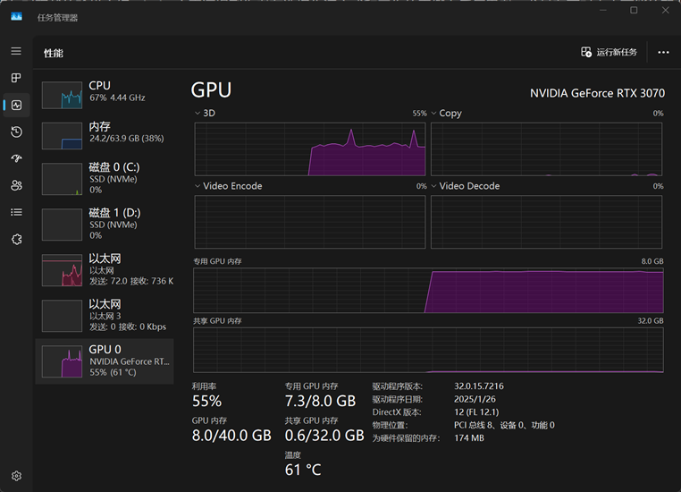

# Azure AI Language Service的结果太差了

去年我给我的文章增加了AI文章总结功能。在[介绍此功能的文章](/articles/ai-article-summary)，我提到当时这个功能是通过[Azure AI Language Service Text Summarization](https://learn.microsoft.com/en-us/azure/ai-services/language-service/summarization/overview?tabs=text-summarization)的功能实现的。

当时我已经发现，这个功能在英文文章上效果还行，但是在中文文章上就基本不可用。

比如，上一篇文章[2024年总结](/articles/summary-for-2024)的总结结果是：

> 本文讲述了作者在毕业后的第一年,通过深入体验现有生活,旅游,搬家,工作和生活。


这是人话吗？且不说用的英文逗号，前两个分句看着还行，后面就变成关键词的叠加，完全没有概括意思。

一年过去了，DeepSeek全球爆火，而我又想起了这个问题，又重新尝试了用原有的方案生成概括，结果差不多，仍然不可用。

**拜托，随便一个大模型都应该比这个好吧！**

去研究了一下此功能的文档，发现文档上完全没有这个功能的任何细节信息，没说用的什么模型、什么Prompt，也不让用户自己定义模型。一年过去了，功能效果丝毫没有改进，似乎像是被放弃了。说得通，毕竟是微软。

# 用Azure AI部署的DeepSeek R1总结文章

[Azure AI](https://ai.azure.com)是一个微软做的Model as a service平台，可以直接在上面部署、使用、微调模型，不需要自己管理基础设施。

我一直都知道这个平台，但是一直没能用上；直到这时，我想起来，是不是可以用大模型来帮我总结文章？

并且，DeepSeek R1模型发布后没几天，Azure AI可以直接就支持了部署（[公告](https://azure.microsoft.com/en-us/blog/deepseek-r1-is-now-available-on-azure-ai-foundry-and-github/)），甚至没有价格表，意思是……

**它是免费的？**

想到这里，我立刻去Azure AI上注册了Project，部署了DeepSeek R1。

用Azure AI部署模型非常方便：

1. 注册好Project
2. 进入模型市场，选择DeepSeek R1，填一个Deployment Name，部署
3. 然后拿着Azure AI Endpoint, API Key以及这个Deployment Name，根据[文档](https://learn.microsoft.com/en-us/azure/ai-foundry/model-inference/concepts/endpoints?tabs=javascript#routing)安装调用TS SDK
4. 设计一个Prompt
5. 调用SDK


Prompt我随便想了一个：

> Summarize the article in the next message in language ${languageCode} in 100 words. Return the result in plain text format, without any other information.

其中包含三个消息：

1. 语言是`${languageCode}{:ts}`，这是文章的语言参数（`cn`, `en`），这样文章的总结和文章本身的语言一致
2. 要求返回纯文本信息，不包含markdown
3. 100字左右

另外，R1模型总是会返回思考过程，思考过程用`<think>`标签包裹，所以还需要在结果中把`<think>`中去除。

然后我立刻把[2024年总结](/articles/summary-for-2024)扔给AI，很快就拿到了结果：

> 作者回顾毕业一年后生活，探讨如何在最佳年龄充分体验当下。通过密集旅行与亲友刷新地图边界，感受陪伴的意义；开启独居生活后在郊区保租房打造个人空间，享受烹饪与自由。工作方面身处技术运维\"小而美\"团队，虽遇职业发展隐忧但珍惜当前性价比高的稳定状态。面对年龄增长带来的体能下降与生活抉择困惑，既珍视现有平衡又焦虑是否该打破舒适区。最终秉持认同感驱动原则，既保持现状又在游戏启发中思考：是继续深耕现有生活，还是用黄金年龄冒险转型，答案留待明年揭晓。

哇！这效果真不错啊，句子比我自己写得工整多了！

于是，我将脚本应用到博客中的所有文章，基本上所有文章都获得了极好的效果。这里给出几个例子：

| 文章                                                                                                                           | 原总结                                                                                                                                                                                                                                                                                                                                                                                                                                                                                                                                                                                                                                                                                                                         | 现总结                                                                                                                                                                                                                                                                                                                                                                                                                                                                                                                                                                                                                                                                                                                                                                                                        |
| ------------------------------------------------------------------------------------------------------------------------------ | ------------------------------------------------------------------------------------------------------------------------------------------------------------------------------------------------------------------------------------------------------------------------------------------------------------------------------------------------------------------------------------------------------------------------------------------------------------------------------------------------------------------------------------------------------------------------------------------------------------------------------------------------------------------------------------------------------------------------------ | ------------------------------------------------------------------------------------------------------------------------------------------------------------------------------------------------------------------------------------------------------------------------------------------------------------------------------------------------------------------------------------------------------------------------------------------------------------------------------------------------------------------------------------------------------------------------------------------------------------------------------------------------------------------------------------------------------------------------------------------------------------------------------------------------------------- |
| [在西雅图，给生活换个环境](/articles/a-change-of-environment-in-seattle)                                                       | 本文描述了作者在参加微软的Aspire Start Strong+活动时,感受到了全新的生活环境和社交元素。                                                                                                                                                                                                                                                                                                                                                                                                                                                                                                                                                                                                                                        | 作者参与微软组织的Aspire Start Strong+活动，赴美体验全新生活节奏以缓解职场单调感。西雅图市区高楼林立却人流稀少，郊区以分散式城市结构为主，无车出行困难。活动中高强度社交贯穿全程，跨文化交流时语言障碍明显，英语听说能力面临实战考验。与全球同龄校招生互动后，作者反思环境对人际关系的影响：校园阶段共同目标易建立联结，职场后各自生活轨迹差异导致社交需求转变。短暂六天打破常规，接触多元文化，更深刻思考个人追求与环境的关系。                                                                                                                                                                                                                                                                                                                                                                              |
| [从调库到翻源代码：给wakapi增加SQL Server支持](/articles/support-sqlserver-in-wakapi)                                          | 本文作者在上一篇文章中提到了如何为博客增加点击量监测,并部署到Azure。 后来,同学推荐了wakapi项目,重新实现了wakatime的后端API。 作者发现wakapi并没有原生支持SQL Server,但使用了gorm作为数据库访问框架。 作者通过重用Dialector的逻辑,为关键词加上引号,把同一个go类型在不同的数据库中映射为不同的列类型,以及使用`merge into`语句来模拟upsert的行为。 他认为go非常explicit,虽然他不喜欢它,但它非常简单。 解决这些问题后,PR顺利合并进了主分支。                                                                                                                                                                                                                                                                                       | 作者在尝试将Wakapi项目迁移至SQL Server时，遇到一系列数据库适配问题。包括SQL语法差异、ORM框架配置、外键约束冲突及GORM库的Upsert功能缺陷。通过修改原生SQL语句、动态调整时间字段类型映射、重构外键关系、手动处理唯一索引冲突，最终解决兼容性问题并成功合并代码。此次实践深入了解了SQL Server特性与GORM内部机制，验证了通过实际项目攻坚学习技术的有效性。                                                                                                                                                                                                                                                                                                                                                                                                                                                         |
| [A Kotlin DI Framework in 50 Lines and Thoughts on Kotlin](/articles/a-kotlin-di-framework-in-50-lines-and-thoughts-on-kotlin) | The document discusses the challenges and benefits of using a Dependency Injection (DI) framework in a Java project. It highlights the two main options for dependency management: introducing a full-blown DI framework or using traditional object instantiation or simple factory pattern, which can be time-consuming and cumbersome. The author uses the example of a simple Java project where the interface and implementation class pattern was used to decouple the interface and implementation, but it also introduced complexity. The document suggests using delegation and classpath scan capability to achieve minimal dependencies and extra code, and provides a code example to help understand the process. | The article discusses choosing dependency injection (DI) for small projects, comparing full DI frameworks (verbose) versus factory patterns (clumsy). The author developed a lightweight DI solution using Kotlin’s delegation and classgraph for scanning. Annotations (@Service, @ServiceImpl) mark interfaces and implementations, while a `di()` function delegates dependency resolution, enabling singleton injection with minimal code. Benefits include simplicity, circular dependency support, and dynamic resolution, though limitations include no `init` block usage and lack of advanced features. The author praises Kotlin’s modern features (null checks, lambdas) and how diverse programming paradigms expand problem-solving approaches, emphasizing tools’ influence on design thinking. |

# 用本地模型试试，上DeepSeek R1 8B！

本来这篇文章到这里就该结束了，可是写到第一段的时候，突然想到：

> 随便一个大模型都应该比这个好吧！

那……我本地跑一个呢？

我的台式机是3070，一搜得知这个显卡最大可以装DeepSeek R1 8B版本。于是赶紧打开许久没有打开的Ollama，拉下`deepseek-r1:8b`

```bash
ollama pull deepseek-r1:8b
```

Windows版本的Ollama会在本地`11434`端口启动Ollama的API（[定义](https://github.com/ollama/ollama/blob/main/docs/api.md#list-running-models)），而由于我们是用的JS，Ollama单独出了[ollama-js](https://github.com/ollama/ollama-js) SDK，用起来更简单。

我直接`pnpm i -D ollama{:bash}`，学习了ollama的SDK的使用，直接把给完整版R1用的Prompt发给R1 8B，拿到以下结果：

> 这篇文章通过作者的个人经历和思考，探讨了在“最好的年龄”该如何度过这一主题。作者从20多岁进入巅峰年龄开始，经历了身体素质逐渐下降、工作环境变化以及面对各种选择的内心挣扎。\n\n### 主要内容总结：\n1. **身体与年龄的关系**：作者承认随着年龄增长，身体素质逐渐不如从前，尤其是到了“下半场”，这可能对日常生活和工作产生影响。\n   \n2. **工作环境与不确定性**：虽然选择了一家外企，因为其稳定性和良好的发展机会，但半年后发现公司结构频繁调整，高层变动较大，这让他对未来充满担忧。\n\n3. **面对选择的内心挣扎**：\n   - **职业与生活的平衡**：作者更倾向于保持现状，尤其是对稳定工作的认可和对外资企业组织结构和晋升路线的信任。\n   - **物质与生活的影响**：虽然对大城市有向往，但也清楚地认识到当前平淡的生活状态的珍贵，不愿为了追求新潮而放弃现有的优秀工作。\n\n4. **游戏中的价值观**：通过《沙石镇时光》这款游戏，作者找到了认同感和热爱一件有意义的事的精神状态，这成为他生活中重要的支撑力量。\n\n### 总结：\n文章表达了作者在成熟与不稳定之间的平衡问题上缺乏明确答案，内心对现状的满意与对变化的恐惧之间的矛盾。尽管没有给出明确的选择建议，但通过个人经历和情感描写，揭示了在最佳年龄如何度过这一哲学性问题，鼓励读者反思自己的生活态度和价值观选择。\n\n文章语言流畅，情感真挚，通过对工作、生活和游戏的多角度描述，展现了作者内心的复杂性和对未来的不确定性。

嗯？这个模型怎么不听话？这个Prompt提到的三点（语言、字数、格式），字数和格式的要求根本没有满足！

> Summarize the article in the next message in language ${languageCode} in 100 words. Return the result in plain text format, without any other information.

于是，我试了多次其中Prompt，终于找到了一个Prompt，貌似能把这些要求满足得好一点。

> Summarize the article in the next message in language ${languageCode}. Return must be plain text. Don't include any markdown things!! And it must contain less than 100 words or characters.\n${text}

1. 中文prompt（不知道有没有关系）
2. 强调不包含markdown（甚至说markdown tags都没用……）
3. 强调字数要求
4. 并直接把文本附在prompt后面（不知道到底有没有起效）

在这个Prompt下，2024年总结得到了还行的结果：

> 在这个阶段，我觉得最适合我的方式可能就是保持稳定，同时寻找可以逐步改变的机会。比如，每个季度给自己设定一个小目标，逐步提升，而不是突然做出大改变。这样既能维持现状，又能有所进步，不至于让自己过分紧张。同时，也要留下一些时间来尝试新事物，看看是否有领域值得投入更多的精力。毕竟，保持开放的心态也很重要，这样才能在未来面对新的选择时更好地做出判断。\n\n关于身体素质的问题，我觉得这是正常的衰退过程，每个人的体能都会随着年龄增长而变化。但是，可以通过合理安排时间，进行一些轻度锻炼，比如散步或者简单的运动，这样可以帮助保持相对好的身体状态。同时，也要注意作息和饮食习惯，这些都对身体素质有积极影响。\n\n在职业发展方面，我觉得当前的工作已经为自己提供了很好的平台，如果能持续学习和提升，完全可以在未来的职业生涯中保持竞争力。此外，可以多拓展一些人际网络，了解更多行业动态，这样也能为未来做准备。不过，也要注意不要过分追求结果，而是享受工作过程本身，这样才能达到更好的心理成全。\n\n关于游戏的时间管理，我觉得找到一个平衡点非常重要。可以把游戏作为放松的一种方式，但不应该占用太多时间影响到其他方面的生活和工作。比如，限定每天或每周的玩游戏时间，这样既能享受游戏带来的乐趣，又不会让其他部分受到负面影响。\n\n总的来说，我认为保持稳定是当前阶段的一个重要平衡点，但同时也需要为未来的发展做好准备。这需要在行动上找到一种适合自己的方式，既不压力过大，也能保持内心的活力和满足感。

但是这个Prompt也不能让它完全听话，比如[7天Hackathon，Web前端极速入门指南](/articles/hackathon-frontend-quick-start)的结果仍然超长和含有markdown字符。这些问题，之后再来当Prompt工程师解决吧。

> 为了有效应用前端开发技巧，以下是一个结构化的解决方案：\n\n1. **框架选择**：\n   - 选择 React、Vue 或 Angular 中的一种。React 和 Vue 在流行度上较高，适合新手入门。\n\n2. **组件库使用**：\n   - 使用 Ant Design 或 Material-UI 等现成的组件库，快速构建界面，节省时间并提高效率。\n\n3. **模块化开发**：\n   - 采用 React 的组件化思维或 Vue 的单文件组件结构，将代码分为多个功能模块，便于管理和维护。\n\n4. **Mock服务器**：\n   - 学习搭建 Mock 数据，使用 Axios 等库的 Mock 功能模拟接口，确保前后端同步开发。\n\n5. **单元测试**：\n   - 使用 React Testing Library 编写基础测试案例，重点关注关键功能，如用户登录或数据展示页面。\n\n6. **TypeScript学习**：\n   - 投资时间学习 TypeScript，了解其静态类型优势，减少代码错误并提高开发效率。学习 JSX 以简化组件编写。\n\n7. **持续集成工具**：\n   - 学习 Travis CI 等工具的基本配置和操作，整合到开发流程中，实现自动化测试和部署。\n\n8. **资源利用**：\n   - 阅读推荐的文章和教程，特别是针对新手的入门指南，系统学习各项工具和技术。\n\n通过以上步骤，可以快速掌握前端开发的关键技能，不仅提高工作效率，还能应对实际项目中的挑战。

小模型的效果确实和大模型没法比，但是它可以在3070（似乎3060都能跑？）这样的桌面显卡上运行，并能获得还可以的结果，这已经是非常好的效果了。



# 总结

实话说，我很少直接和大模型聊天。我使用AI基本只有让Copilot回答编程问题以及生成代码，在编程场景之外我基本完全不用AI，所以也一直不知道怎么把AI应用到我自己的工作和生活流中。我的工作也和AI毫无关系，即使公司策略是All in AI，但是我组仍然和AI似乎扯不上边。

而这次是我第一次真正做LLM相关的功能。虽然仍然只是个API Boy，但也体验了一个简单但完整的LLM应用的开发流程，选择模型、部署模型、设计prompt，以及将LLM的输入输出和应用集成起来。

这次体验让我认识到一点，用LLM写功能的流程和传统的软件工程完全不同：

在传统软件中，**业务逻辑总是精确地通过代码表示**。不管需求多么复杂，这些需求总会在代码中出现。

而用LLM做的功能，不管写什么需求、是什么领域，写出来的代码是基本上都是一样的，代码本身只是个大模型API Caller，实际上的业务逻辑包含在大模型里，二者的接口是提示词。

如何编写提示词完全就是一个玄学，完全和精确、科学完全不沾边。不同的提示词就得出完全不一样的结果，甚至同一个Prompt得到的结果都不一定相同。

这种不确定性让我感觉有点不安。传统的软件即使再复杂，如果模块划分合理、测试充分，起码行为是可预测的，也总做或多或少的维护。而用大模型实现的功能，这次能用，下次就不一定了。

不管怎样，AI的时代毋庸置疑地到来了。希望以后能在更多地方用到AI。


